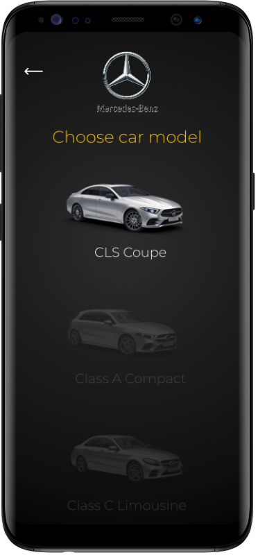
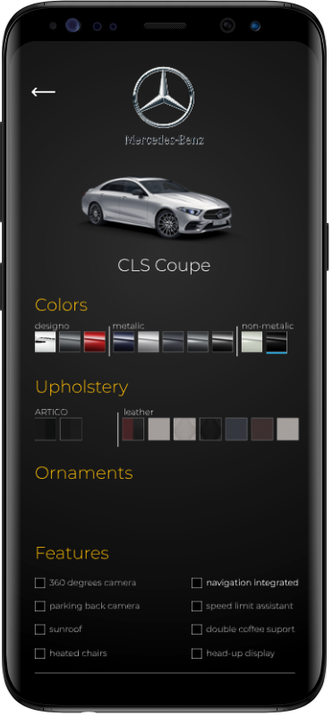
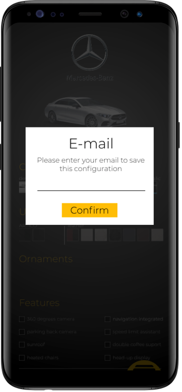
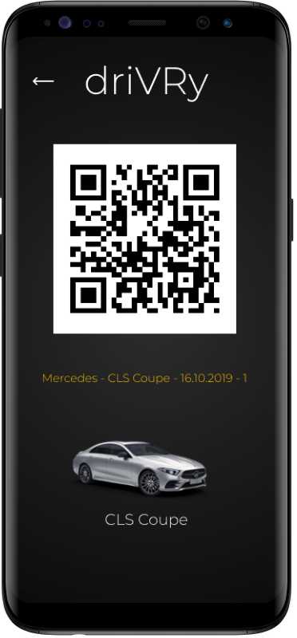
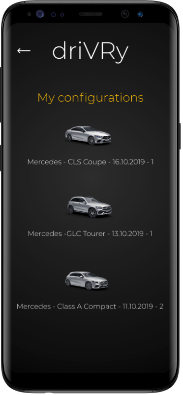
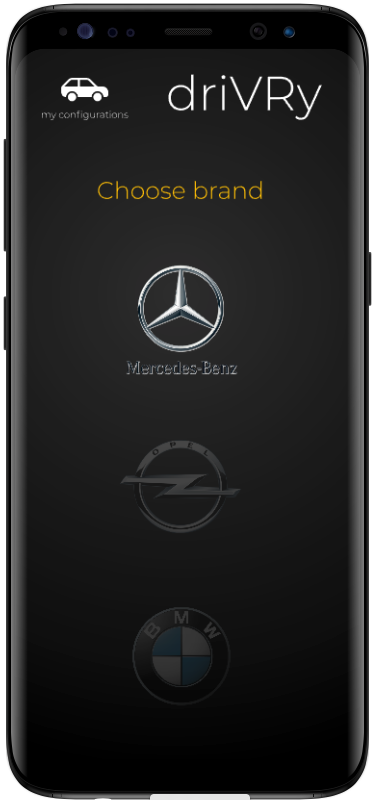
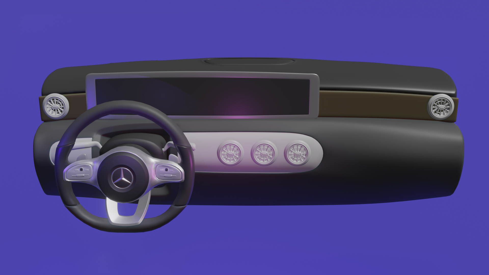
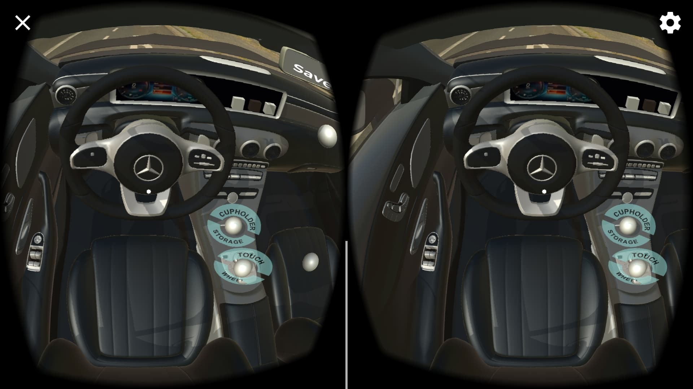

# Team22
# driVRy

## Requirements:

* [Unity](https://unity.com "Unity")
* [Google Cardboard sdk](https://github.com/googlevr/gvr-unity-sdk/releases "google cardboard sdk")
* [Android sdk](https://developer.android.com/studio/?&gclid=Cj0KCQjw_5rtBRDxARIsAJfxvYABYiZNWByrh-H0zG3Z-YLHyzBqvNMWNQf0B31xQjeNMSFCaoaiQo0aAoR1EALw_wcB "Android SDK")

## Installation:
To use this repository you will need to open this project in unity 3d.

## Project structure:

* Assets: Application assets
 * Editor Default Resources
    * Firebase: Firebase default sprites
 * Firebase: Firebase sdk
 * Fonts: Application fonts
    * Montserrat: our primary font
 * GoogleVR: Google VR sdk
 * Parse: part of Firebase sdk
 * PlayServiceResolver
 * Plugins: Firebase library
 * Prefabs: Our prefab objects 
 * Scenes: Menu(non VR scene) and showroom(VR scene)
 * Scripts: 
    * FirebaseManager.cs: connect to firebase and store user car configurations
    * MenuManager.cs: navigate trough app screens
    * MenuNavItem.cs: simple class for VR navigation menu
    * PanelManager.cs: navigate trough VR panel screen for car configuration
    *  VRManager.cs: change Virtual Reality SDK to cardboard before VR scene start
 * Ui props: 2d sprites

## Screenshots:

